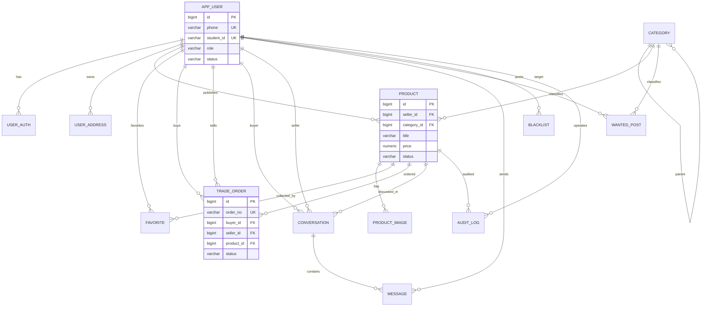
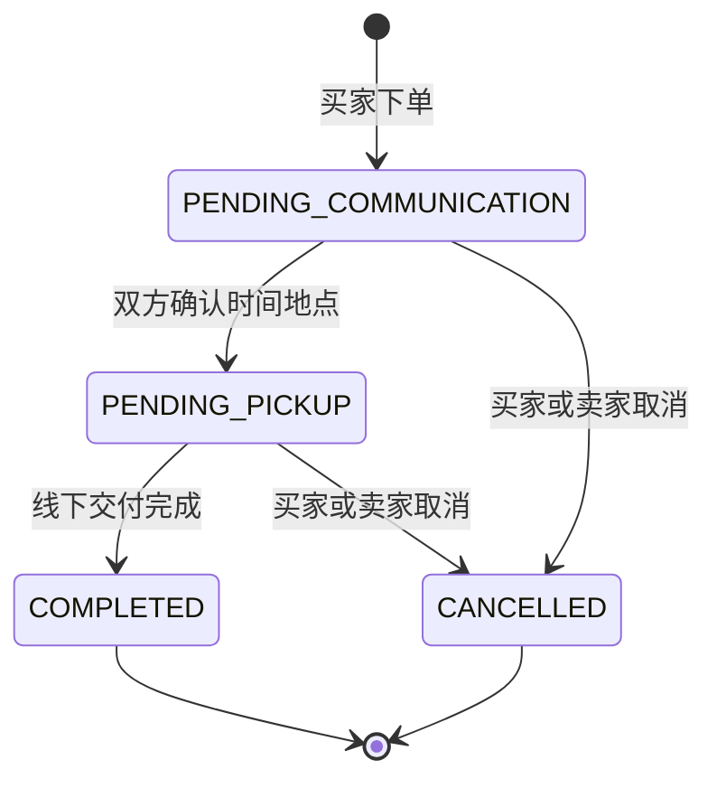

# 校园闲置物品智慧流转平台数据库设计文档

> 数据库：PostgreSQL 14+  
> 文档版本：v1.0  
> 依据文档：`PRD.md`、`TechnicalDesign.md`、成员任务书  
> 说明：本文以 PostgreSQL 为准。为避免 `user`、`order` 等关键字或保留词带来的转义问题，物理表名采用 `app_user`、`trade_order`；后端实体仍可命名为 `User`、`Order`。

---

## 1. 设计目标

本数据库支撑校园二手闲置交易 MVP 的完整闭环：

- 用户注册、登录、校园身份认证、地址管理
- 商品发布、图片管理、类目管理、审核、上下架
- 商品搜索、收藏、私信沟通
- 订单生成、状态流转、取消与成交记录
- 管理端商品审核、黑名单、基础数据看板
- 求购功能预留，支持后续智能匹配

---

## 2. 数据库约定

### 2.1 命名规范

| 类型 | 规范 | 示例 |
|------|------|------|
| 表名 | 小写蛇形命名，业务前缀清晰 | `app_user`, `trade_order` |
| 字段名 | 小写蛇形命名 | `created_at`, `student_id` |
| 主键 | 统一使用 `id BIGSERIAL` | `id BIGSERIAL PRIMARY KEY` |
| 外键 | `fk_表名_字段名` | `fk_product_seller` |
| 唯一约束 | `uk_表名_字段组合` | `uk_app_user_phone` |
| 普通索引 | `idx_表名_字段组合` | `idx_product_status_created` |

### 2.2 通用字段

多数业务表包含以下字段：

| 字段 | 类型 | 说明 |
|------|------|------|
| `created_at` | `TIMESTAMPTZ` | 创建时间，默认 `now()` |
| `updated_at` | `TIMESTAMPTZ` | 更新时间，默认 `now()`，由应用层或触发器维护 |
| `deleted_at` | `TIMESTAMPTZ` | 软删除时间，可空 |

### 2.3 状态值约定

| 业务 | 字段 | 允许值 |
|------|------|--------|
| 用户角色 | `app_user.role` | `USER`, `ADMIN`, `SUPER_ADMIN` |
| 用户状态 | `app_user.status` | `ACTIVE`, `BLACKLISTED`, `DISABLED` |
| 认证类型 | `user_auth.auth_type` | `PHONE`, `STUDENT_ID`, `MANUAL` |
| 认证状态 | `user_auth.auth_status` | `PENDING`, `VERIFIED`, `REJECTED` |
| 商品成色 | `product.condition_level` | `NEW`, `LIKE_NEW`, `USED`, `OLD` |
| 交易方式 | `product.trade_type` | `PICKUP`, `DELIVERY`, `BOTH` |
| 商品状态 | `product.status` | `PENDING_REVIEW`, `ON_SALE`, `REJECTED`, `OFF_SHELF`, `SOLD`, `VIOLATION_DELISTED`, `DELETED` |
| 订单状态 | `trade_order.status` | `PENDING_COMMUNICATION`, `PENDING_PICKUP`, `COMPLETED`, `CANCELLED` |
| 会话状态 | `conversation.status` | `ACTIVE`, `CLOSED` |
| 消息类型 | `message.message_type` | `TEXT`, `SYSTEM` |
| 求购状态 | `wanted_post.status` | `OPEN`, `CLOSED`, `EXPIRED`, `DELETED` |
| 黑名单状态 | `blacklist.status` | `ACTIVE`, `REMOVED` |
| 审核动作 | `audit_log.action` | `APPROVE`, `REJECT`, `VIOLATION_DELIST`, `RELIEVE_VIOLATION` |

---

## 3. ER 图



---

## 4. 表清单

| 序号 | 表名 | 业务实体 | 说明 |
|------|------|----------|------|
| 1 | `app_user` | 用户 | 平台用户、管理员基础信息 |
| 2 | `user_auth` | 用户认证 | 手机号、学号、人工认证记录 |
| 3 | `user_address` | 收货地址 | 校园地址簿 |
| 4 | `category` | 商品类目 | 一级/二级类目树 |
| 5 | `product` | 商品 | 闲置商品主表 |
| 6 | `product_image` | 商品图片 | 商品图片与主图 |
| 7 | `favorite` | 收藏 | 用户收藏商品关系 |
| 8 | `trade_order` | 订单 | 交易订单主表 |
| 9 | `conversation` | 会话 | 买卖双方围绕商品的私信会话 |
| 10 | `message` | 消息 | 会话消息明细 |
| 11 | `wanted_post` | 求购 | 求购需求帖 |
| 12 | `blacklist` | 黑名单 | 违规用户黑名单记录 |
| 13 | `audit_log` | 审核日志 | 商品审核和违规下架日志 |

---

## 5. 数据表详细设计

### 5.1 `app_user` 用户表

| 字段 | 类型 | 约束 | 说明 |
|------|------|------|------|
| `id` | `BIGSERIAL` | PK | 用户 ID |
| `phone` | `VARCHAR(20)` | NOT NULL, UNIQUE | 手机号 |
| `student_id` | `VARCHAR(32)` | UNIQUE | 学号，认证后唯一 |
| `real_name` | `VARCHAR(50)` |  | 真实姓名 |
| `nickname` | `VARCHAR(50)` | NOT NULL | 昵称 |
| `avatar_url` | `VARCHAR(500)` |  | 头像地址 |
| `password_hash` | `VARCHAR(100)` | NOT NULL | BCrypt 密码哈希 |
| `contact_phone` | `VARCHAR(20)` |  | 展示/联系手机号，可脱敏 |
| `role` | `VARCHAR(20)` | NOT NULL, CHECK | 用户角色 |
| `status` | `VARCHAR(20)` | NOT NULL, CHECK | 用户状态 |
| `last_login_at` | `TIMESTAMPTZ` |  | 最近登录时间 |
| `created_at` | `TIMESTAMPTZ` | NOT NULL | 创建时间 |
| `updated_at` | `TIMESTAMPTZ` | NOT NULL | 更新时间 |
| `deleted_at` | `TIMESTAMPTZ` |  | 软删除时间 |

关键约束：

- `phone` 唯一，保证一个手机号一个账号。
- `student_id` 唯一，保证一个学号只能认证一个账号。
- 黑名单用户通过 `status = 'BLACKLISTED'` 禁止发布商品、下单交易。

### 5.2 `user_auth` 用户认证表

| 字段 | 类型 | 约束 | 说明 |
|------|------|------|------|
| `id` | `BIGSERIAL` | PK | 认证记录 ID |
| `user_id` | `BIGINT` | NOT NULL, FK | 用户 ID |
| `auth_type` | `VARCHAR(20)` | NOT NULL, CHECK | 认证类型 |
| `auth_status` | `VARCHAR(20)` | NOT NULL, CHECK | 认证状态 |
| `identifier` | `VARCHAR(100)` | NOT NULL | 认证标识，如手机号/学号 |
| `verified_at` | `TIMESTAMPTZ` |  | 认证通过时间 |
| `reject_reason` | `VARCHAR(255)` |  | 驳回原因 |
| `created_at` | `TIMESTAMPTZ` | NOT NULL | 创建时间 |

关键约束：

- `user_id + auth_type + identifier` 唯一，避免重复认证记录。
- 手机号与学号认证均通过后，用户才具备完整交易能力。

### 5.3 `user_address` 收货地址表

| 字段 | 类型 | 约束 | 说明 |
|------|------|------|------|
| `id` | `BIGSERIAL` | PK | 地址 ID |
| `user_id` | `BIGINT` | NOT NULL, FK | 用户 ID |
| `contact_name` | `VARCHAR(50)` | NOT NULL | 联系人 |
| `contact_phone` | `VARCHAR(20)` | NOT NULL | 联系电话 |
| `campus` | `VARCHAR(100)` | NOT NULL | 校区 |
| `building` | `VARCHAR(100)` | NOT NULL | 楼栋 |
| `room` | `VARCHAR(100)` |  | 宿舍号/办公室 |
| `detail` | `VARCHAR(255)` |  | 补充地址 |
| `is_default` | `BOOLEAN` | NOT NULL | 是否默认地址 |
| `created_at` | `TIMESTAMPTZ` | NOT NULL | 创建时间 |
| `updated_at` | `TIMESTAMPTZ` | NOT NULL | 更新时间 |
| `deleted_at` | `TIMESTAMPTZ` |  | 软删除时间 |

关键约束：

- 同一用户最多一个未删除默认地址，通过部分唯一索引实现。

### 5.4 `category` 商品类目表

| 字段 | 类型 | 约束 | 说明 |
|------|------|------|------|
| `id` | `BIGSERIAL` | PK | 类目 ID |
| `parent_id` | `BIGINT` | FK | 父类目 ID，空表示一级类目 |
| `name` | `VARCHAR(50)` | NOT NULL | 类目名称 |
| `icon` | `VARCHAR(255)` |  | 图标地址或图标名 |
| `sort_order` | `INTEGER` | NOT NULL | 排序值，越小越靠前 |
| `status` | `VARCHAR(20)` | NOT NULL, CHECK | `ACTIVE` / `DISABLED` |
| `created_at` | `TIMESTAMPTZ` | NOT NULL | 创建时间 |
| `updated_at` | `TIMESTAMPTZ` | NOT NULL | 更新时间 |

关键约束：

- 一级类目名称唯一。
- 二级类目在同一父类目下名称唯一。
- 删除类目前应先确认不存在关联商品或仅做禁用。

### 5.5 `product` 商品表

| 字段 | 类型 | 约束 | 说明 |
|------|------|------|------|
| `id` | `BIGSERIAL` | PK | 商品 ID |
| `seller_id` | `BIGINT` | NOT NULL, FK | 卖家用户 ID |
| `category_id` | `BIGINT` | NOT NULL, FK | 类目 ID |
| `title` | `VARCHAR(80)` | NOT NULL | 商品标题 |
| `description` | `TEXT` | NOT NULL | 商品描述 |
| `price` | `NUMERIC(10,2)` | NOT NULL, CHECK | 售价 |
| `original_price` | `NUMERIC(10,2)` | CHECK | 原价 |
| `condition_level` | `VARCHAR(20)` | NOT NULL, CHECK | 商品成色 |
| `trade_type` | `VARCHAR(20)` | NOT NULL, CHECK | 交易方式 |
| `trade_location` | `VARCHAR(255)` |  | 交易范围/地点备注 |
| `status` | `VARCHAR(30)` | NOT NULL, CHECK | 商品状态 |
| `view_count` | `INTEGER` | NOT NULL | 浏览次数 |
| `favorite_count` | `INTEGER` | NOT NULL | 收藏次数，可由异步或应用层维护 |
| `published_at` | `TIMESTAMPTZ` |  | 上架时间 |
| `sold_at` | `TIMESTAMPTZ` |  | 成交时间 |
| `created_at` | `TIMESTAMPTZ` | NOT NULL | 创建时间 |
| `updated_at` | `TIMESTAMPTZ` | NOT NULL | 更新时间 |
| `deleted_at` | `TIMESTAMPTZ` |  | 软删除时间 |

关键约束：

- 标题长度 2~80，描述长度 10~5000。
- 售价必须大于 0 且不超过 99999.99。
- 商品发布后默认 `PENDING_REVIEW`，审核通过后进入 `ON_SALE`。
- 成交后状态变为 `SOLD`，并设置 `sold_at`。

### 5.6 `product_image` 商品图片表

| 字段 | 类型 | 约束 | 说明 |
|------|------|------|------|
| `id` | `BIGSERIAL` | PK | 图片 ID |
| `product_id` | `BIGINT` | NOT NULL, FK | 商品 ID |
| `image_url` | `VARCHAR(500)` | NOT NULL | 图片地址 |
| `sort_order` | `INTEGER` | NOT NULL | 排序，从 1 开始 |
| `is_main` | `BOOLEAN` | NOT NULL | 是否主图 |
| `created_at` | `TIMESTAMPTZ` | NOT NULL | 创建时间 |

关键约束：

- 同一商品最多 9 张图，由应用层校验。
- 同一商品最多一个主图，通过部分唯一索引实现。
- `product_id + sort_order` 唯一。

### 5.7 `favorite` 收藏表

| 字段 | 类型 | 约束 | 说明 |
|------|------|------|------|
| `id` | `BIGSERIAL` | PK | 收藏 ID |
| `user_id` | `BIGINT` | NOT NULL, FK | 用户 ID |
| `product_id` | `BIGINT` | NOT NULL, FK | 商品 ID |
| `created_at` | `TIMESTAMPTZ` | NOT NULL | 收藏时间 |

关键约束：

- `user_id + product_id` 唯一，支持收藏 toggle。
- 用户不能收藏已软删除商品，由应用层校验。

### 5.8 `trade_order` 订单表

| 字段 | 类型 | 约束 | 说明 |
|------|------|------|------|
| `id` | `BIGSERIAL` | PK | 订单 ID |
| `order_no` | `VARCHAR(32)` | NOT NULL, UNIQUE | 订单号 |
| `buyer_id` | `BIGINT` | NOT NULL, FK | 买家 ID |
| `seller_id` | `BIGINT` | NOT NULL, FK | 卖家 ID |
| `product_id` | `BIGINT` | NOT NULL, FK | 商品 ID |
| `price` | `NUMERIC(10,2)` | NOT NULL | 下单时成交价快照 |
| `trade_type` | `VARCHAR(20)` | NOT NULL, CHECK | 交易方式快照 |
| `pickup_time` | `TIMESTAMPTZ` |  | 约定自提时间 |
| `pickup_location` | `VARCHAR(255)` |  | 约定自提地点 |
| `status` | `VARCHAR(30)` | NOT NULL, CHECK | 订单状态 |
| `cancel_reason` | `VARCHAR(255)` |  | 取消原因 |
| `cancelled_by` | `BIGINT` | FK | 取消人 ID |
| `confirmed_at` | `TIMESTAMPTZ` |  | 确认待自提时间 |
| `completed_at` | `TIMESTAMPTZ` |  | 完成时间 |
| `cancelled_at` | `TIMESTAMPTZ` |  | 取消时间 |
| `created_at` | `TIMESTAMPTZ` | NOT NULL | 创建时间 |
| `updated_at` | `TIMESTAMPTZ` | NOT NULL | 更新时间 |

关键约束：

- 买家不能等于卖家。
- 同一商品只能存在一个未取消订单，通过部分唯一索引实现。
- 订单状态由应用层按状态机控制：`PENDING_COMMUNICATION -> PENDING_PICKUP -> COMPLETED`，前两种状态可取消。

### 5.9 `conversation` 会话表

| 字段 | 类型 | 约束 | 说明 |
|------|------|------|------|
| `id` | `BIGSERIAL` | PK | 会话 ID |
| `product_id` | `BIGINT` | NOT NULL, FK | 商品 ID |
| `buyer_id` | `BIGINT` | NOT NULL, FK | 买家 ID |
| `seller_id` | `BIGINT` | NOT NULL, FK | 卖家 ID |
| `last_message` | `VARCHAR(500)` |  | 最后一条消息摘要 |
| `last_message_at` | `TIMESTAMPTZ` |  | 最后消息时间 |
| `buyer_unread_count` | `INTEGER` | NOT NULL | 买家未读数 |
| `seller_unread_count` | `INTEGER` | NOT NULL | 卖家未读数 |
| `status` | `VARCHAR(20)` | NOT NULL, CHECK | 会话状态 |
| `created_at` | `TIMESTAMPTZ` | NOT NULL | 创建时间 |
| `updated_at` | `TIMESTAMPTZ` | NOT NULL | 更新时间 |

关键约束：

- `product_id + buyer_id + seller_id` 唯一。
- 买家不能等于卖家。

### 5.10 `message` 消息表

| 字段 | 类型 | 约束 | 说明 |
|------|------|------|------|
| `id` | `BIGSERIAL` | PK | 消息 ID |
| `conversation_id` | `BIGINT` | NOT NULL, FK | 会话 ID |
| `sender_id` | `BIGINT` | NOT NULL, FK | 发送人 ID |
| `content` | `TEXT` | NOT NULL | 消息内容 |
| `message_type` | `VARCHAR(20)` | NOT NULL, CHECK | 消息类型 |
| `is_read` | `BOOLEAN` | NOT NULL | 对方是否已读 |
| `read_at` | `TIMESTAMPTZ` |  | 已读时间 |
| `created_at` | `TIMESTAMPTZ` | NOT NULL | 发送时间 |

关键约束：

- 文本消息长度 1~1000。
- `sender_id` 必须是会话买家或卖家之一，此约束由应用层校验。

### 5.11 `wanted_post` 求购表

| 字段 | 类型 | 约束 | 说明 |
|------|------|------|------|
| `id` | `BIGSERIAL` | PK | 求购 ID |
| `user_id` | `BIGINT` | NOT NULL, FK | 发布用户 ID |
| `category_id` | `BIGINT` | NOT NULL, FK | 类目 ID |
| `title` | `VARCHAR(80)` | NOT NULL | 求购标题/物品名称 |
| `description` | `TEXT` | NOT NULL | 需求描述 |
| `min_price` | `NUMERIC(10,2)` |  | 预期最低价 |
| `max_price` | `NUMERIC(10,2)` |  | 预期最高价 |
| `expire_at` | `TIMESTAMPTZ` |  | 有效期 |
| `status` | `VARCHAR(20)` | NOT NULL, CHECK | 求购状态 |
| `created_at` | `TIMESTAMPTZ` | NOT NULL | 创建时间 |
| `updated_at` | `TIMESTAMPTZ` | NOT NULL | 更新时间 |
| `deleted_at` | `TIMESTAMPTZ` |  | 软删除时间 |

关键约束：

- 最高价不能低于最低价。
- MVP 可仅建表预留，匹配结果由查询实时计算，不单独落库。

### 5.12 `blacklist` 黑名单表

| 字段 | 类型 | 约束 | 说明 |
|------|------|------|------|
| `id` | `BIGSERIAL` | PK | 黑名单记录 ID |
| `user_id` | `BIGINT` | NOT NULL, FK | 被处理用户 ID |
| `reason` | `VARCHAR(255)` | NOT NULL | 拉黑原因 |
| `operator_id` | `BIGINT` | NOT NULL, FK | 操作管理员 ID |
| `status` | `VARCHAR(20)` | NOT NULL, CHECK | 黑名单状态 |
| `removed_reason` | `VARCHAR(255)` |  | 解除原因 |
| `removed_by` | `BIGINT` | FK | 解除操作人 |
| `removed_at` | `TIMESTAMPTZ` |  | 解除时间 |
| `created_at` | `TIMESTAMPTZ` | NOT NULL | 拉黑时间 |

关键约束：

- 同一用户最多一条生效黑名单记录，通过部分唯一索引实现。

### 5.13 `audit_log` 审核日志表

| 字段 | 类型 | 约束 | 说明 |
|------|------|------|------|
| `id` | `BIGSERIAL` | PK | 审核日志 ID |
| `product_id` | `BIGINT` | NOT NULL, FK | 商品 ID |
| `operator_id` | `BIGINT` | NOT NULL, FK | 管理员 ID |
| `action` | `VARCHAR(30)` | NOT NULL, CHECK | 审核动作 |
| `from_status` | `VARCHAR(30)` |  | 操作前商品状态 |
| `to_status` | `VARCHAR(30)` | NOT NULL | 操作后商品状态 |
| `reason` | `VARCHAR(255)` |  | 审核/下架原因 |
| `created_at` | `TIMESTAMPTZ` | NOT NULL | 操作时间 |

关键约束：

- 所有商品审核通过、驳回、违规下架操作都应写入本表，便于追溯。

---

## 6. 核心索引设计

| 表 | 索引 | 目的 |
|----|------|------|
| `app_user` | `phone`, `student_id` 唯一索引 | 注册登录、认证去重 |
| `product` | `(status, created_at DESC)` | 首页上架商品分页 |
| `product` | `(category_id, status, created_at DESC)` | 分类筛选 |
| `product` | `(seller_id, status, created_at DESC)` | 我的发布 |
| `favorite` | `(user_id, product_id)` 唯一索引 | 收藏去重 |
| `trade_order` | `order_no` 唯一索引 | 订单号查询 |
| `trade_order` | `(buyer_id, status, created_at DESC)` | 我买到的 |
| `trade_order` | `(seller_id, status, created_at DESC)` | 我卖出的 |
| `conversation` | `(product_id, buyer_id, seller_id)` 唯一索引 | 会话去重 |
| `message` | `(conversation_id, created_at DESC)` | 消息分页 |
| `wanted_post` | `(category_id, status, created_at DESC)` | 求购检索 |
| `blacklist` | `user_id WHERE status='ACTIVE'` | 生效黑名单去重 |
| `audit_log` | `(product_id, created_at DESC)` | 商品审核历史 |

---

## 7. PostgreSQL DDL

```sql
-- PostgreSQL 14+

CREATE TABLE app_user (
    id BIGSERIAL PRIMARY KEY,
    phone VARCHAR(20) NOT NULL,
    student_id VARCHAR(32),
    real_name VARCHAR(50),
    nickname VARCHAR(50) NOT NULL DEFAULT '校园用户',
    avatar_url VARCHAR(500),
    password_hash VARCHAR(100) NOT NULL,
    contact_phone VARCHAR(20),
    role VARCHAR(20) NOT NULL DEFAULT 'USER',
    status VARCHAR(20) NOT NULL DEFAULT 'ACTIVE',
    last_login_at TIMESTAMPTZ,
    created_at TIMESTAMPTZ NOT NULL DEFAULT now(),
    updated_at TIMESTAMPTZ NOT NULL DEFAULT now(),
    deleted_at TIMESTAMPTZ,
    CONSTRAINT uk_app_user_phone UNIQUE (phone),
    CONSTRAINT uk_app_user_student_id UNIQUE (student_id),
    CONSTRAINT ck_app_user_phone CHECK (phone ~ '^1[3-9][0-9]{9}$'),
    CONSTRAINT ck_app_user_role CHECK (role IN ('USER', 'ADMIN', 'SUPER_ADMIN')),
    CONSTRAINT ck_app_user_status CHECK (status IN ('ACTIVE', 'BLACKLISTED', 'DISABLED'))
);

CREATE TABLE user_auth (
    id BIGSERIAL PRIMARY KEY,
    user_id BIGINT NOT NULL,
    auth_type VARCHAR(20) NOT NULL,
    auth_status VARCHAR(20) NOT NULL DEFAULT 'PENDING',
    identifier VARCHAR(100) NOT NULL,
    verified_at TIMESTAMPTZ,
    reject_reason VARCHAR(255),
    created_at TIMESTAMPTZ NOT NULL DEFAULT now(),
    CONSTRAINT fk_user_auth_user FOREIGN KEY (user_id) REFERENCES app_user(id),
    CONSTRAINT uk_user_auth_identity UNIQUE (user_id, auth_type, identifier),
    CONSTRAINT ck_user_auth_type CHECK (auth_type IN ('PHONE', 'STUDENT_ID', 'MANUAL')),
    CONSTRAINT ck_user_auth_status CHECK (auth_status IN ('PENDING', 'VERIFIED', 'REJECTED'))
);

CREATE TABLE user_address (
    id BIGSERIAL PRIMARY KEY,
    user_id BIGINT NOT NULL,
    contact_name VARCHAR(50) NOT NULL,
    contact_phone VARCHAR(20) NOT NULL,
    campus VARCHAR(100) NOT NULL,
    building VARCHAR(100) NOT NULL,
    room VARCHAR(100),
    detail VARCHAR(255),
    is_default BOOLEAN NOT NULL DEFAULT false,
    created_at TIMESTAMPTZ NOT NULL DEFAULT now(),
    updated_at TIMESTAMPTZ NOT NULL DEFAULT now(),
    deleted_at TIMESTAMPTZ,
    CONSTRAINT fk_user_address_user FOREIGN KEY (user_id) REFERENCES app_user(id),
    CONSTRAINT ck_user_address_phone CHECK (contact_phone ~ '^1[3-9][0-9]{9}$')
);

CREATE UNIQUE INDEX uk_user_address_default
    ON user_address(user_id)
    WHERE is_default = true AND deleted_at IS NULL;

CREATE TABLE category (
    id BIGSERIAL PRIMARY KEY,
    parent_id BIGINT,
    name VARCHAR(50) NOT NULL,
    icon VARCHAR(255),
    sort_order INTEGER NOT NULL DEFAULT 0,
    status VARCHAR(20) NOT NULL DEFAULT 'ACTIVE',
    created_at TIMESTAMPTZ NOT NULL DEFAULT now(),
    updated_at TIMESTAMPTZ NOT NULL DEFAULT now(),
    CONSTRAINT fk_category_parent FOREIGN KEY (parent_id) REFERENCES category(id),
    CONSTRAINT ck_category_status CHECK (status IN ('ACTIVE', 'DISABLED')),
    CONSTRAINT ck_category_sort CHECK (sort_order >= 0)
);

CREATE UNIQUE INDEX uk_category_root_name
    ON category(name)
    WHERE parent_id IS NULL;

CREATE UNIQUE INDEX uk_category_child_name
    ON category(parent_id, name)
    WHERE parent_id IS NOT NULL;

CREATE TABLE product (
    id BIGSERIAL PRIMARY KEY,
    seller_id BIGINT NOT NULL,
    category_id BIGINT NOT NULL,
    title VARCHAR(80) NOT NULL,
    description TEXT NOT NULL,
    price NUMERIC(10,2) NOT NULL,
    original_price NUMERIC(10,2),
    condition_level VARCHAR(20) NOT NULL,
    trade_type VARCHAR(20) NOT NULL,
    trade_location VARCHAR(255),
    status VARCHAR(30) NOT NULL DEFAULT 'PENDING_REVIEW',
    view_count INTEGER NOT NULL DEFAULT 0,
    favorite_count INTEGER NOT NULL DEFAULT 0,
    published_at TIMESTAMPTZ,
    sold_at TIMESTAMPTZ,
    created_at TIMESTAMPTZ NOT NULL DEFAULT now(),
    updated_at TIMESTAMPTZ NOT NULL DEFAULT now(),
    deleted_at TIMESTAMPTZ,
    CONSTRAINT fk_product_seller FOREIGN KEY (seller_id) REFERENCES app_user(id),
    CONSTRAINT fk_product_category FOREIGN KEY (category_id) REFERENCES category(id),
    CONSTRAINT ck_product_title_len CHECK (char_length(title) BETWEEN 2 AND 80),
    CONSTRAINT ck_product_description_len CHECK (char_length(description) BETWEEN 10 AND 5000),
    CONSTRAINT ck_product_price CHECK (price > 0 AND price <= 99999.99),
    CONSTRAINT ck_product_original_price CHECK (original_price IS NULL OR original_price >= price),
    CONSTRAINT ck_product_condition CHECK (condition_level IN ('NEW', 'LIKE_NEW', 'USED', 'OLD')),
    CONSTRAINT ck_product_trade_type CHECK (trade_type IN ('PICKUP', 'DELIVERY', 'BOTH')),
    CONSTRAINT ck_product_status CHECK (
        status IN ('PENDING_REVIEW', 'ON_SALE', 'REJECTED', 'OFF_SHELF', 'SOLD', 'VIOLATION_DELISTED', 'DELETED')
    ),
    CONSTRAINT ck_product_count CHECK (view_count >= 0 AND favorite_count >= 0)
);

CREATE INDEX idx_product_status_created ON product(status, created_at DESC);
CREATE INDEX idx_product_category_status_created ON product(category_id, status, created_at DESC);
CREATE INDEX idx_product_seller_status_created ON product(seller_id, status, created_at DESC);

CREATE TABLE product_image (
    id BIGSERIAL PRIMARY KEY,
    product_id BIGINT NOT NULL,
    image_url VARCHAR(500) NOT NULL,
    sort_order INTEGER NOT NULL DEFAULT 1,
    is_main BOOLEAN NOT NULL DEFAULT false,
    created_at TIMESTAMPTZ NOT NULL DEFAULT now(),
    CONSTRAINT fk_product_image_product FOREIGN KEY (product_id) REFERENCES product(id) ON DELETE CASCADE,
    CONSTRAINT uk_product_image_sort UNIQUE (product_id, sort_order),
    CONSTRAINT ck_product_image_sort CHECK (sort_order BETWEEN 1 AND 9)
);

CREATE UNIQUE INDEX uk_product_image_main
    ON product_image(product_id)
    WHERE is_main = true;

CREATE TABLE favorite (
    id BIGSERIAL PRIMARY KEY,
    user_id BIGINT NOT NULL,
    product_id BIGINT NOT NULL,
    created_at TIMESTAMPTZ NOT NULL DEFAULT now(),
    CONSTRAINT fk_favorite_user FOREIGN KEY (user_id) REFERENCES app_user(id),
    CONSTRAINT fk_favorite_product FOREIGN KEY (product_id) REFERENCES product(id) ON DELETE CASCADE,
    CONSTRAINT uk_favorite_user_product UNIQUE (user_id, product_id)
);

CREATE INDEX idx_favorite_user_created ON favorite(user_id, created_at DESC);

CREATE TABLE trade_order (
    id BIGSERIAL PRIMARY KEY,
    order_no VARCHAR(32) NOT NULL,
    buyer_id BIGINT NOT NULL,
    seller_id BIGINT NOT NULL,
    product_id BIGINT NOT NULL,
    price NUMERIC(10,2) NOT NULL,
    trade_type VARCHAR(20) NOT NULL,
    pickup_time TIMESTAMPTZ,
    pickup_location VARCHAR(255),
    status VARCHAR(30) NOT NULL DEFAULT 'PENDING_COMMUNICATION',
    cancel_reason VARCHAR(255),
    cancelled_by BIGINT,
    confirmed_at TIMESTAMPTZ,
    completed_at TIMESTAMPTZ,
    cancelled_at TIMESTAMPTZ,
    created_at TIMESTAMPTZ NOT NULL DEFAULT now(),
    updated_at TIMESTAMPTZ NOT NULL DEFAULT now(),
    CONSTRAINT uk_trade_order_no UNIQUE (order_no),
    CONSTRAINT fk_trade_order_buyer FOREIGN KEY (buyer_id) REFERENCES app_user(id),
    CONSTRAINT fk_trade_order_seller FOREIGN KEY (seller_id) REFERENCES app_user(id),
    CONSTRAINT fk_trade_order_product FOREIGN KEY (product_id) REFERENCES product(id),
    CONSTRAINT fk_trade_order_cancelled_by FOREIGN KEY (cancelled_by) REFERENCES app_user(id),
    CONSTRAINT ck_trade_order_buyer_seller CHECK (buyer_id <> seller_id),
    CONSTRAINT ck_trade_order_price CHECK (price > 0 AND price <= 99999.99),
    CONSTRAINT ck_trade_order_trade_type CHECK (trade_type IN ('PICKUP', 'DELIVERY', 'BOTH')),
    CONSTRAINT ck_trade_order_status CHECK (
        status IN ('PENDING_COMMUNICATION', 'PENDING_PICKUP', 'COMPLETED', 'CANCELLED')
    ),
    CONSTRAINT ck_trade_order_cancel CHECK (
        (status <> 'CANCELLED') OR (cancel_reason IS NOT NULL AND cancelled_by IS NOT NULL AND cancelled_at IS NOT NULL)
    )
);

CREATE UNIQUE INDEX uk_trade_order_product_active
    ON trade_order(product_id)
    WHERE status <> 'CANCELLED';

CREATE INDEX idx_trade_order_buyer_status_created ON trade_order(buyer_id, status, created_at DESC);
CREATE INDEX idx_trade_order_seller_status_created ON trade_order(seller_id, status, created_at DESC);

CREATE TABLE conversation (
    id BIGSERIAL PRIMARY KEY,
    product_id BIGINT NOT NULL,
    buyer_id BIGINT NOT NULL,
    seller_id BIGINT NOT NULL,
    last_message VARCHAR(500),
    last_message_at TIMESTAMPTZ,
    buyer_unread_count INTEGER NOT NULL DEFAULT 0,
    seller_unread_count INTEGER NOT NULL DEFAULT 0,
    status VARCHAR(20) NOT NULL DEFAULT 'ACTIVE',
    created_at TIMESTAMPTZ NOT NULL DEFAULT now(),
    updated_at TIMESTAMPTZ NOT NULL DEFAULT now(),
    CONSTRAINT fk_conversation_product FOREIGN KEY (product_id) REFERENCES product(id),
    CONSTRAINT fk_conversation_buyer FOREIGN KEY (buyer_id) REFERENCES app_user(id),
    CONSTRAINT fk_conversation_seller FOREIGN KEY (seller_id) REFERENCES app_user(id),
    CONSTRAINT uk_conversation_unique UNIQUE (product_id, buyer_id, seller_id),
    CONSTRAINT ck_conversation_buyer_seller CHECK (buyer_id <> seller_id),
    CONSTRAINT ck_conversation_status CHECK (status IN ('ACTIVE', 'CLOSED')),
    CONSTRAINT ck_conversation_unread CHECK (buyer_unread_count >= 0 AND seller_unread_count >= 0)
);

CREATE INDEX idx_conversation_buyer_updated ON conversation(buyer_id, updated_at DESC);
CREATE INDEX idx_conversation_seller_updated ON conversation(seller_id, updated_at DESC);

CREATE TABLE message (
    id BIGSERIAL PRIMARY KEY,
    conversation_id BIGINT NOT NULL,
    sender_id BIGINT NOT NULL,
    content TEXT NOT NULL,
    message_type VARCHAR(20) NOT NULL DEFAULT 'TEXT',
    is_read BOOLEAN NOT NULL DEFAULT false,
    read_at TIMESTAMPTZ,
    created_at TIMESTAMPTZ NOT NULL DEFAULT now(),
    CONSTRAINT fk_message_conversation FOREIGN KEY (conversation_id) REFERENCES conversation(id) ON DELETE CASCADE,
    CONSTRAINT fk_message_sender FOREIGN KEY (sender_id) REFERENCES app_user(id),
    CONSTRAINT ck_message_content_len CHECK (char_length(content) BETWEEN 1 AND 1000),
    CONSTRAINT ck_message_type CHECK (message_type IN ('TEXT', 'SYSTEM'))
);

CREATE INDEX idx_message_conversation_created ON message(conversation_id, created_at DESC);

CREATE TABLE wanted_post (
    id BIGSERIAL PRIMARY KEY,
    user_id BIGINT NOT NULL,
    category_id BIGINT NOT NULL,
    title VARCHAR(80) NOT NULL,
    description TEXT NOT NULL,
    min_price NUMERIC(10,2),
    max_price NUMERIC(10,2),
    expire_at TIMESTAMPTZ,
    status VARCHAR(20) NOT NULL DEFAULT 'OPEN',
    created_at TIMESTAMPTZ NOT NULL DEFAULT now(),
    updated_at TIMESTAMPTZ NOT NULL DEFAULT now(),
    deleted_at TIMESTAMPTZ,
    CONSTRAINT fk_wanted_post_user FOREIGN KEY (user_id) REFERENCES app_user(id),
    CONSTRAINT fk_wanted_post_category FOREIGN KEY (category_id) REFERENCES category(id),
    CONSTRAINT ck_wanted_post_title_len CHECK (char_length(title) BETWEEN 2 AND 80),
    CONSTRAINT ck_wanted_post_description_len CHECK (char_length(description) BETWEEN 10 AND 3000),
    CONSTRAINT ck_wanted_post_price CHECK (
        (min_price IS NULL OR min_price >= 0)
        AND (max_price IS NULL OR max_price >= 0)
        AND (min_price IS NULL OR max_price IS NULL OR max_price >= min_price)
    ),
    CONSTRAINT ck_wanted_post_status CHECK (status IN ('OPEN', 'CLOSED', 'EXPIRED', 'DELETED'))
);

CREATE INDEX idx_wanted_post_category_status_created ON wanted_post(category_id, status, created_at DESC);
CREATE INDEX idx_wanted_post_user_created ON wanted_post(user_id, created_at DESC);

CREATE TABLE blacklist (
    id BIGSERIAL PRIMARY KEY,
    user_id BIGINT NOT NULL,
    reason VARCHAR(255) NOT NULL,
    operator_id BIGINT NOT NULL,
    status VARCHAR(20) NOT NULL DEFAULT 'ACTIVE',
    removed_reason VARCHAR(255),
    removed_by BIGINT,
    removed_at TIMESTAMPTZ,
    created_at TIMESTAMPTZ NOT NULL DEFAULT now(),
    CONSTRAINT fk_blacklist_user FOREIGN KEY (user_id) REFERENCES app_user(id),
    CONSTRAINT fk_blacklist_operator FOREIGN KEY (operator_id) REFERENCES app_user(id),
    CONSTRAINT fk_blacklist_removed_by FOREIGN KEY (removed_by) REFERENCES app_user(id),
    CONSTRAINT ck_blacklist_status CHECK (status IN ('ACTIVE', 'REMOVED')),
    CONSTRAINT ck_blacklist_remove CHECK (
        (status = 'ACTIVE' AND removed_at IS NULL)
        OR (status = 'REMOVED' AND removed_by IS NOT NULL AND removed_at IS NOT NULL)
    )
);

CREATE UNIQUE INDEX uk_blacklist_active_user
    ON blacklist(user_id)
    WHERE status = 'ACTIVE';

CREATE TABLE audit_log (
    id BIGSERIAL PRIMARY KEY,
    product_id BIGINT NOT NULL,
    operator_id BIGINT NOT NULL,
    action VARCHAR(30) NOT NULL,
    from_status VARCHAR(30),
    to_status VARCHAR(30) NOT NULL,
    reason VARCHAR(255),
    created_at TIMESTAMPTZ NOT NULL DEFAULT now(),
    CONSTRAINT fk_audit_log_product FOREIGN KEY (product_id) REFERENCES product(id),
    CONSTRAINT fk_audit_log_operator FOREIGN KEY (operator_id) REFERENCES app_user(id),
    CONSTRAINT ck_audit_log_action CHECK (action IN ('APPROVE', 'REJECT', 'VIOLATION_DELIST', 'RELIEVE_VIOLATION'))
);

CREATE INDEX idx_audit_log_product_created ON audit_log(product_id, created_at DESC);
CREATE INDEX idx_audit_log_operator_created ON audit_log(operator_id, created_at DESC);

-- 初始化一级类目
INSERT INTO category (name, sort_order, icon) VALUES
('教材', 10, 'book'),
('数码', 20, 'device'),
('宿舍用品', 30, 'home'),
('运动器材', 40, 'sport'),
('其他', 99, 'more');
```

---

## 8. 关键业务约束说明

### 8.1 用户注册与认证

1. `app_user.phone` 保证手机号唯一。
2. `app_user.student_id` 保证学号唯一。
3. 注册成功后写入 `user_auth` 的手机号和学号认证记录。
4. 管理员账号通过初始化 SQL 或后台超级管理员配置，`role` 设置为 `ADMIN` 或 `SUPER_ADMIN`。

### 8.2 商品发布与审核

1. 商品发布后状态为 `PENDING_REVIEW`。
2. 审核通过：`product.status = 'ON_SALE'`，写入 `audit_log`。
3. 审核驳回：`product.status = 'REJECTED'`，写入驳回原因。
4. 用户下架：`product.status = 'OFF_SHELF'`。
5. 违规下架：`product.status = 'VIOLATION_DELISTED'`，写入 `audit_log`。
6. 成交后：`product.status = 'SOLD'`，设置 `sold_at`。

### 8.3 订单状态机



数据库负责保存状态值与关键时间点；合法状态流转由应用层用枚举和服务逻辑保证。

### 8.4 私信会话

1. 买家在商品详情页点击联系卖家时创建 `conversation`。
2. 同一商品、同一买家、同一卖家只能存在一个会话。
3. `message` 保存消息明细，`conversation` 冗余最后消息和未读数，提升会话列表查询效率。

### 8.5 求购匹配

MVP 阶段仅保存 `wanted_post`。智能匹配可通过如下条件实时查询：

- `wanted_post.category_id = product.category_id`
- `product.status = 'ON_SALE'`
- 标题/描述关键词匹配
- 价格区间重叠

后续若需要固化推荐结果，可新增 `wanted_match` 表保存匹配分数和推送状态。

---

## 9. 与模块开发的对应关系

| 模块 | 主要表 |
|------|--------|
| 用户模块 | `app_user`, `user_auth`, `user_address` |
| 商品模块 | `category`, `product`, `product_image` |
| 搜索模块 | `product`, `category` |
| 收藏模块 | `favorite`, `product` |
| 订单模块 | `trade_order`, `product`, `app_user` |
| 私信模块 | `conversation`, `message`, `product`, `app_user` |
| 求购模块 | `wanted_post`, `product`, `category` |
| 管理模块 | `audit_log`, `blacklist`, `product`, `app_user`, `category`, `trade_order` |

---

## 10. 后续扩展建议

| 扩展方向 | 建议新增/调整 |
|----------|---------------|
| 商品评价与信用体系 | 新增 `review`, `user_credit_stat` |
| 系统通知 | 新增 `notification` |
| 固化求购匹配结果 | 新增 `wanted_match` |
| 高级数据看板 | 新增统计快照表，如 `daily_stat` |
| 文件资产统一管理 | 新增 `file_asset`，记录上传文件元数据 |
| 审计追踪增强 | 新增 `operation_log`，记录管理端敏感操作 |
